<!-- markdownlint-disable -->

	 
    <h1>Hi there , I'm Dmitrii Demenev.</h1>
	 

I'm a Middle+ Software Engineer with [over a decade of experience](https://github.com/JohnScience/my_com_projs) who does

* 🦀 Rust,
* 📦 Open-source,
* 💻 Full-stack (80% backend),
* 📱 Cross-platform,
* 🌐 Cross-language interoperability [^1].

I'm a down-to-earth guy who learns the arts of humble brag and setting sane expectations to be trusted but not expected to do the factually impossible [^2].

I consider myself a pragmatist[^3] and an eudaimonic[^4] and eclectic individual.

 

	

---

## Achievements

* ⭐ **Star shooter**. I was one of the first 25 software developers at Moonton, the company behind [Mobile Legends: Bang Bang](https://en.wikipedia.org/wiki/Mobile_Legends:_Bang_Bang). This game alone generated the lifetime gross revenue of over $1,106,530,000 USD.
* 🤝 **Trusted**. I authored the [`qualifier_attr`](https://github.com/JohnScience/qualifier_attr) Rust crate, which became a dependency of Solana (24-hour trading volume of $355,645,065.28 USD).
* 📦 **That guy from ~~Nebraska~~ Calgary** ([reference](https://www.explainxkcd.com/wiki/images/d/d7/dependency.png)). My Rust crates have been downloaded from crates.io over 800,000 times (see the live count for yourself with [Google Collab](https://colab.research.google.com/drive/1ReRvXieC7VjOHVda4f1SSGVy5ZGwrMJn?usp=sharing)).
* 📚 **Recognized expert**. Achieved recognition as a SME (Subject Matter Expert) in Rust by Coursera. Technically, they just called me this way in a message. But it counts, right?
* 🌲 **From little seeds grow mighty trees**. Started coding at the age of 10. My dad was a professor at a university and a double PhD in Physics and Mathematics who decided to teach me some C and C++ while I was young. [Rest in peace, dad](https://www.perm.kp.ru/online/news/4474897/).
* ⌨️ **Prolific code monkey** ([reference](https://en.wikipedia.org/wiki/Infinite_monkey_theorem)). Over 200 total GitHub repositories, among which over 100 are public. None of them is Hamlet, yet there are some interesting ones.
* 💪 **Master of my own destiny**. I stayed clear from ever consuming memes, smoking, drinking, or using drugs. I never came close to reaching the rock bottom mentally and stoically endured all the hardships in life. I work out and, as of May 25, have a 280+ day long streak of learning French on Duolingo.

## Also see

* [My biography from the perspective of commercial programming](https://github.com/JohnScience/my_com_projs).

[^1]: [FFI](https://en.wikipedia.org/wiki/Foreign_function_interface), [WebAssembly](https://webassembly.org/), and stuff. I can write code for nearly any other programming language using Rust.
[^2]: I love the challenge and to make the seemingly impossible things the reality.
[^3]: <https://medium.com/@pronskiy/the-great-doctrine-or-10-simple-rules-that-any-developer-should-follow-d0e4b92bd62a>
[^4]: By that I mean that I derive the majority of my happiness from eudaimonics. More on the topic here: https://youtu.be/ry0zG2n0Hyg?si=lZNFmPiirzF7Kcal&t=221
